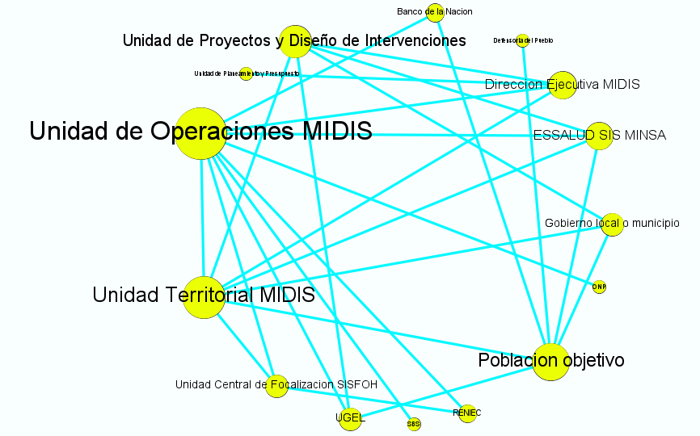
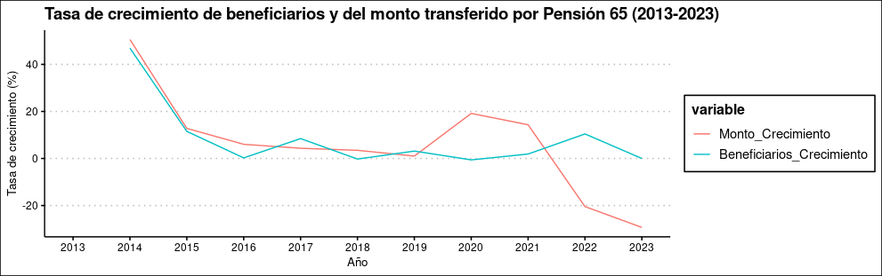

```{r setup, include=FALSE}
library(flexdashboard)
```

Página 1
===================================== 

Column {data-width=433}
-----------------------------------------------------------------------

### Monto de transferencias por región durante el año 2013 (de menor [0] a mayor [1])

```{r}
readRDS("choro2013.rds")
```

Column {data-width=433}
-----------------------------------------------------------------------

### Monto de transferencias por región durante el año 2022 (de menor [0] a mayor [1])

```{r}
readRDS("choro2022.rds")
```
Column {data-width=434}
-----------------------------------------------------------------------

### Regiones que más aumentaron su recepción de transferencias entre 2013 y 2022 (de menor [0] a mayor [1])

```{r}
readRDS("choroDif.rds")
```


Página 2
===================================== 

Column {data-width=500}
-----------------------------------------------------------------------

### Grafo de actores involucrados

```{r picture, echo = F, fig.cap = "Title", out.width = '100%'}

```

Column {data-width=500}
-----------------------------------------------------------------------

### Relación entre monto transferido e ingreso promedio de adultos mayores por región (2013)

```{r}
readRDS("scatter2013.rds")
```

### Relación entre monto transferido e ingreso promedio de adultos mayores por región (2022)

```{r}
readRDS("scatter2022.rds")
```

Página 3 
===================================== 

```{r  out.width = "50%", out.height = "50%"}
 
```


