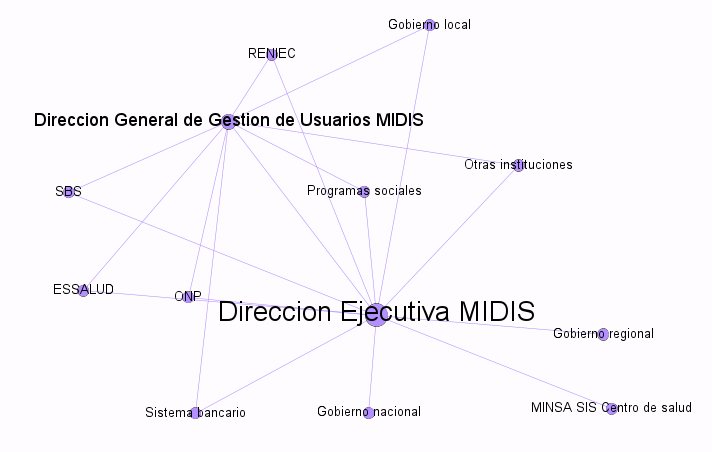

```{r setup, include=FALSE}
library(flexdashboard)
```

Column {data-width=500}
-----------------------------------------------------------------------

### Grafo de actores involucrados

```{r picture, echo = F, fig.cap = "Title", out.width = '100%'}

```

Column {data-width=500}
-----------------------------------------------------------------------

### Relación entre monto transferido e ingreso promedio de adultos mayores por región (2013)

```{r}
readRDS("scatter2013.rds")
```

### Relación entre monto transferido e ingreso promedio de adultos mayores por región (2022)

```{r}
readRDS("scatter2022.rds")
```

