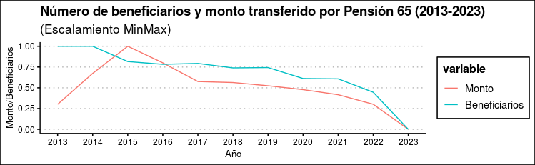

```{r setup, include=FALSE}
library(flexdashboard)
```

Column {data-width=1000}
-----------------------------------------------------------------------

```{r picture, echo = F, fig.cap = "Title", out.width = '100%'}

```


