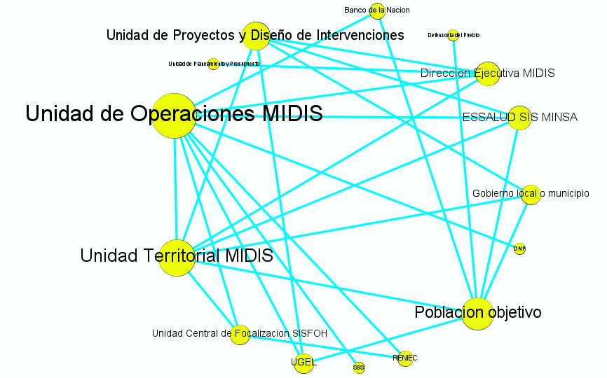
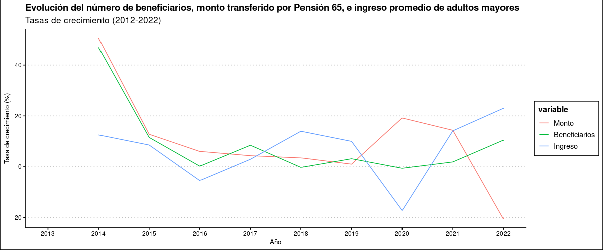

```{r setup, include=FALSE}
library(flexdashboard)
```

Página 1
===================================== 

Column
---------------------------------------------------------

### Relación entre monto transferido (T) e ingreso promedio (I) de adultos mayores por provincia (2013)

```{r}
readRDS("cuadrantes2013.rds")
```

Column
------------------------------------------------------------------

### Relación entre monto transferido  (T) e ingreso promedio (I) de adultos mayores por provincia (2022)

```{r}
readRDS("cuadrantes2022.rds")
```

Página 2
================================================================

Column {data-width=650}
-----------------------------------------------------------------------

### Regiones que más aumentaron su recepción de transferencias entre 2013 y 2022 (de menor [0] a mayor [4])

```{r}
readRDS("choroDif.rds")
```

Column {data-width=650}
-----------------------------------------------------------------------
### Grafo de actores involucrados

```{r picture, echo = F, fig.cap = "Title", out.width = '100%'}

```


Página 3
===================================== 

```{r  out.width = "50%", out.height = "50%"}
 
```


